# **The DMZ <--> MGMT connection conflict. (Conflicto de comunicación DMZ <--> MGMT.)**

- pfSense up and running

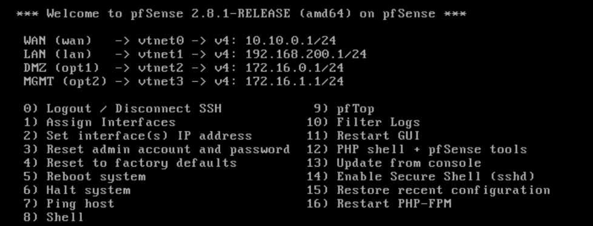

- Four separate networks, each with a different trust level, all routed and filtered through one firewall.*

  * WAN 10.10.0.1/24 Kali Linux 10.10.0.10 external threat, MGMT 172.16.1.1/24 Ubuntu-Wazuh 172.16.1.10, its TCP port 1514 opened to collect event data, logs and warnings from running agents from DMZ 172.16.0.1/24 Debian-DVWA 172.16.0.10 and from LAN 192.168.200.1/24 Windows 11 Enterprise 192.168.200.40 and ADDC MS Server 2025 192.168.200.10, TCP port 1515 for agents' authentication and port 443 open to use Windows 11 as SIEM Management Console, ports opened through pfSense firewall rules

ES:  Cuatro redes separadas, cada una con distintos niveles de confianza, todas enrutadas y filtradas a través de un firewall.*

  * WAN 10.10.0.1/24 Kali Linux 10.10.0.10 amenaza externa, MGMT 172.16.1.1/24 Ubuntu-Wazuh 172.16.1.10 con el puerto TCP 1514 para colectar datos de eventos, registros y advertencias enviadas por agentes activos, provenientes de DMZ 172.16.0.1/24 Debian-DVWA 172.16.0.10, y de LAN 192.168.200.1/24 Windows 11 Enterprise 192.168.200.40 y ADDC MS Server 2025 192.168.200.10, el puerto TCP 1515 para la autenticación de agentes, y el puerto 443 abierto para usar Windows 11 como consola de administración SIEM, puertos abiertos mediante reglas en pfSense firewall.

  LAN:

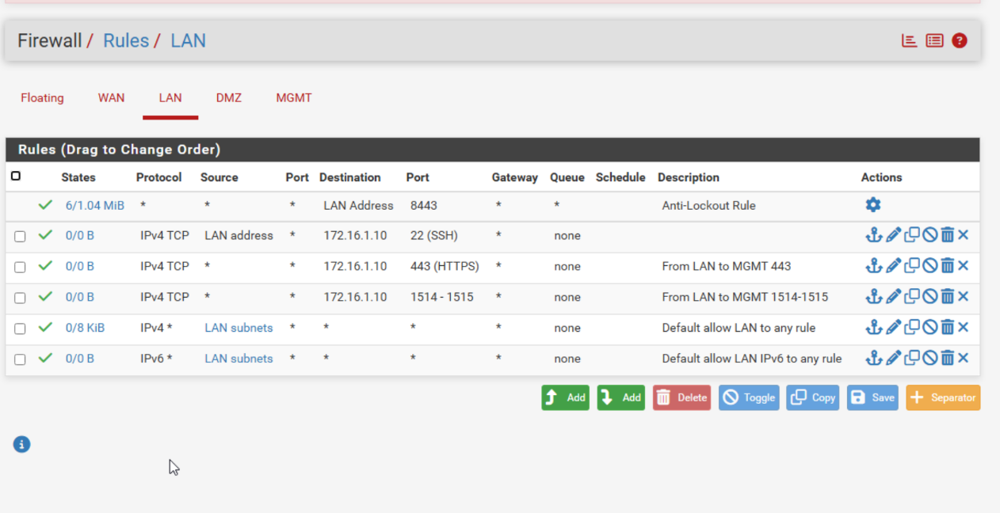

  DMZ:

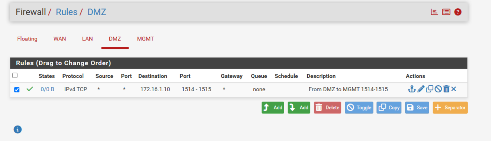

- **Testing connection between MGMT and LAN, and between MGMT and DMZ**

   Windows to Ubuntu-Wazuh ports 443, 1514 and 1515: Working properly.

ES: **Probando la conexión entre MGMT y LAN, y entre MGMT y DMZ**

De Windows a Ubuntu-Wazuh los puertos 443, 1514 y 1515: Funcionando apropiadamente

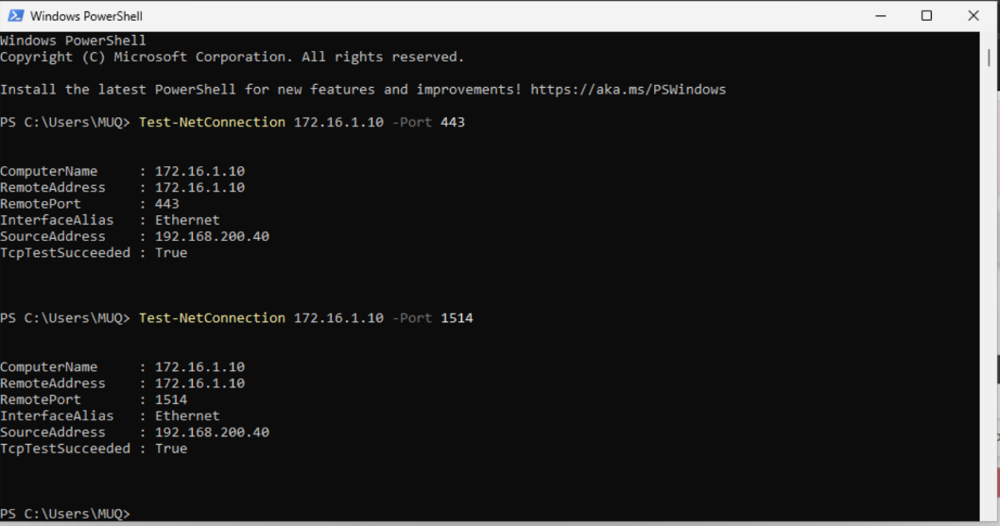

- Debian-DVWA to Ubuntu-Wazuh ports 1514 and 1515: Working properly
  
ES:  De Debian-DVWA a Ubuntu-Wazuh puertos 1514 y 1515: Funcionando apropiadamente

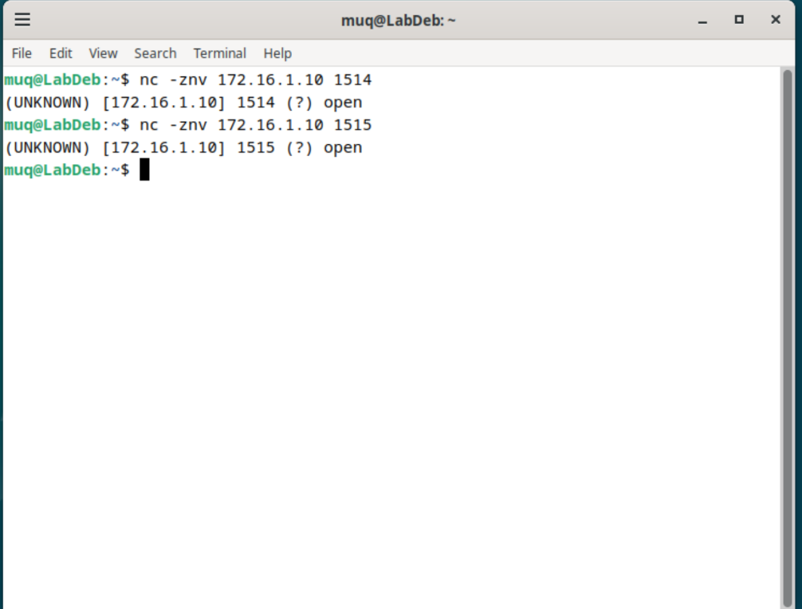

- After rebooting: ports 1514 and 1515 unexpectedly started refusing connections — the actual bug. Port 443 refused too, but that one's expected: DMZ was never supposed to reach the dashboard in the first place.

ES:  Después de reiniciar: los puertos 1514 y 1515 empezaron a rechazar conexiones inesperadamente — el error real. El puerto 443 también fue rechazado, pero eso es lo esperado: DMZ nunca debía poder alcanzar el dashboard.

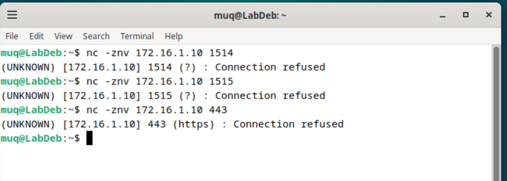

- After looking through pfSense's firewall rules for configuration mistakes, everything was clean; the next step was checking that both Debian-DVWA's and Ubuntu-Wazuh's firewalls were disabled, to rule out that they were responsible for the connection bug.

ES:  Después de revisar entre las reglas establecidas en pfSense firewall no se encontraron errores de configuración, el siguiente paso fue revisar que los firewalls tanto de Debian-DVWA como Ubuntu-Wazuh estuviesen inactivos para descartar que fuesen los causantes del error de conexión.

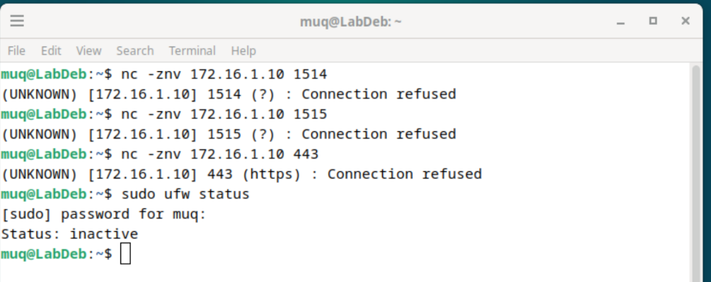

- Ubuntu-Wazuh firewall disabled, then running command ```ss -tulpn``` (socket statistics) to check the network and ports' status on Wazuh, all 3 ports listening.

ES:   Firewall de Ubuntu-Wazuh deshabilitado, luego se corre el comando ```ss -tulpn``` (estadísticas del socket) para verificar el estado de la red y los puertos de Wazuh, los 3 puertos en funcionamiento.

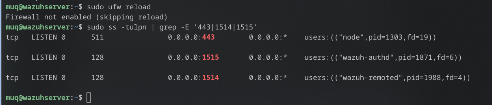

- The next test was to reconfigure the IP address on pfSense


ES:  La siguiente prueba fue mediante la reconfiguración de la dirección IP en pfSense.

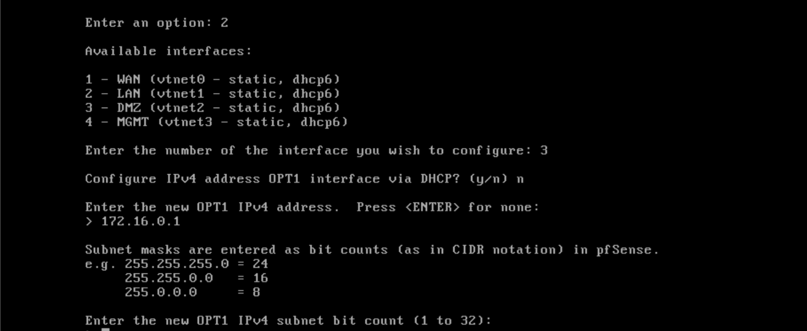

- After rebooting once again, connection testing between Debian-DVWA and Ubuntu-Wazuh was refused. The next tests used pfSense's own diagnostic tools on the WebGUI.

ES:  Después de reiniciar nuevamente al probar la conexión desde Debian-DVWA a Ubuntu-Wazuh esta era rechazada. Las siguientes pruebas se hicieron utilizando las herramientas de diagnóstico propias de pfSense desde su interfaz gráfica.

  MGMT PING --> DMZ

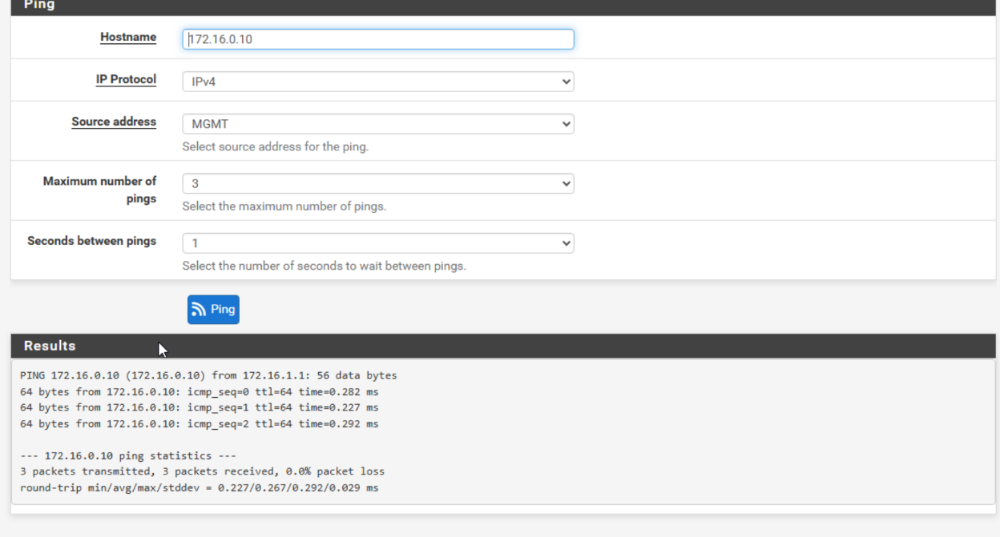

  DMZ PING --> MGMT

  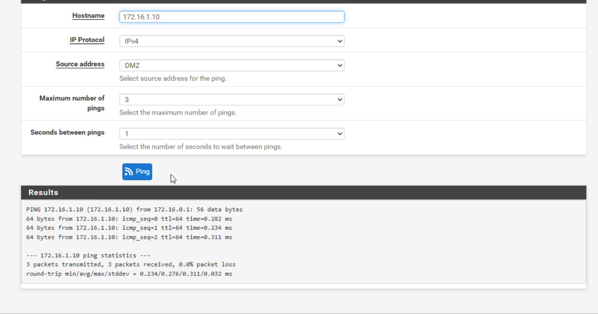

  Both ping tests were successful, with 0% packet loss.

  The next diagnostic tool was the ARP table, looking for discrepancies or anomalies.

ES: En ambas pruebas el ping fue exitoso, 0% de pérdida de paquetes.

La siguiente herramienta de diagnóstico era la tabla ARP, para buscar discrepancias o anomalías.

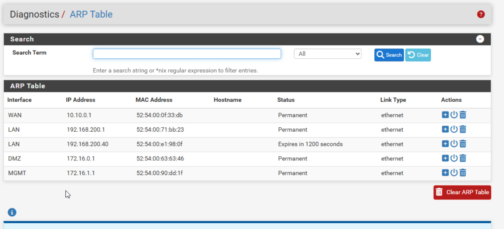

  **Here's the lead anomaly. First, this would be normal behavior (I'll use LAN and Windows as examples): LAN's 192.168.200.1 was assigned on pfSense as the default gateway for all devices connected to pfSense on LAN. Every device on LAN with an IP address in the 192.168.200.1/24 range and 192.168.200.1 as its gateway will reach pfSense as its router's gateway. pfSense assigned this gateway, 192.168.200.1, the MAC address 52:54:00:71:bb:23, and Windows 192.168.200.40 correctly displays its NIC's MAC address, 52:54:00:e1:98:0f. Both of them had their respective MAC addresses displayed on the ARP table.
  Now the anomaly: Debian-DVWA and Ubuntu-Wazuh, which were pinging each other (theoretically) through pfSense after the Windows connection was established with pfSense, don't have their respective NICs' MAC addresses displayed on the ARP table. We can see DMZ's gateway MAC address, 52:54:00:63:63:46, and MGMT's gateway MAC, 52:54:00:90:dd:1f. Then why can't we see Debian-DVWA's and Ubuntu-Wazuh's NIC MAC addresses?**

ES: **Acá está la anomalía principal. Primero, este sería el comportamiento normal (y voy a utilizar LAN y a Windows como ejemplos): LAN 192.168.200.1 fue asignada en pfSense como la puerta de enlace predeterminada para los equipos conectados a pfSense a través de LAN. Cada equipo con una dirección IP en el rango 192.168.200.1/24 y que use como puerta de enlace predeterminada 192.168.200.1 utilizará este acceso a pfSense ya que este se comporta como un router. pfSense le asignó a esta puerta de enlace predeterminada, 192.168.200.1, la dirección MAC 52:54:00:71:bb:23, y Windows 192.168.200.40 muestra la dirección MAC de su NIC, 52:54:00:e1:98:0f. Ambos muestran sus respectivas MACs en la tabla ARP; podemos ver la dirección MAC de la puerta de enlace predeterminada de DMZ, 52:54:00:63:63:46, y la de MGMT, 52:54:00:90:dd:1f. Entonces, ¿por qué no aparecen las direcciones MAC de Debian-DVWA y Ubuntu-Wazuh en la tabla ARP?**

- One last corroboration, using command ```arp -an``` on pfSense's shell to be sure there are no discrepancies with what was shown on the WebGUI.
  
 ES: Una última corroboración, utilizando el comando ```arp -an``` en la línea de comandos en pfSense para asegurarse que no hay discrepancias con lo mostrado en la interfaz de la web.

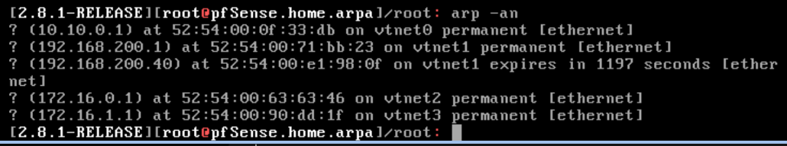

  No discrepancies.
  
ES:  No hay discrepancias.

- Explanation of normal behavior: DMZ is an isolated network, with only 2 devices in it, Debian-DVWA and the router (pfSense). The only possible connection inside this network is between Debian-DVWA and the router; when Debian-DVWA sends an ARP request, the only device listening and available to answer is the router. Using the command ```ip neighbor```, a request is sent to all devices listening for the device with the IPv4 address 172.16.0.1 to answer back its MAC address. One device answers, and the MAC address of this device is: 52:54:00:fb:0a:b1 ... This is it. Problem found.

ES:  Explicación del comportamiento normal: DMZ es una red aislada, con solo 2 dispositivos, Debian-DVWA y un router (pfSense). La única conexión posible dentro de esta red es entre Debian-DVWA y el router; cuando Debian-DVWA envía un pedido ARP, el único equipo escuchando y con posibilidad de respuesta es el router. Usando el comando ```ip neighbor```, se envía un pedido de respuesta de la MAC hacia todos los equipos escuchando, para que el equipo que tiene asignada la dirección IPv4 172.16.0.1 responda de vuelta su dirección MAC. Un equipo responde, y la dirección MAC de este equipo es: 52:54:00:fb:0a:b1 ... Y aquí está, problema encontrado.

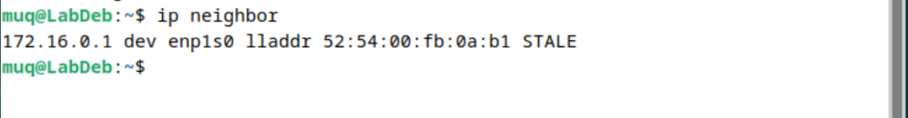

- What's happening here? There's a conflict: the same IP address is being used as the default gateway for the bridge between the virtual network and the host — in this case, Fedora Linux, as seen on *virbr3*. The MAC address answering the MAC request is the bridge's MAC: 52:54:00:fb:0a:b1. The default gateway on pfSense should be the one answering back the MAC request: 52:54:00:63:63:46.

ES:  ¿Qué está ocurriendo aquí? Existe un conflicto: la misma dirección IP está siendo utilizada como puerta de enlace predeterminada del puente entre la red virtual y el sistema operativo anfitrión — en este caso, Fedora Linux, como se muestra en *virbr3*. La dirección MAC que responde al pedido de MAC es la MAC del puente: 52:54:00:fb:0a:b1. La puerta de enlace predeterminada de pfSense debería ser la única que responde de vuelta al pedido de MAC: 52:54:00:63:63:46.

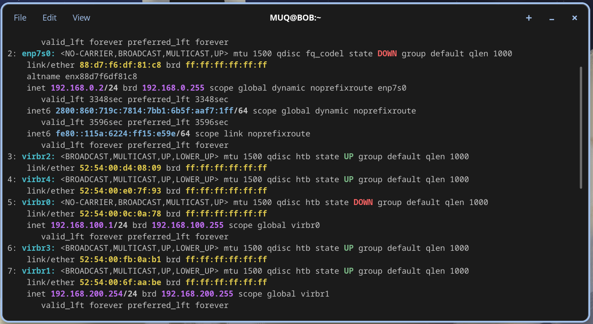

- ***The solution (La solución)***

  There are 2 solutions (both can be used on each network, DMZ or MGMT):
  
  1. Change the IP address of the virtual bridge (virbr) between Fedora Linux (host) and the virtual machine in virt-manager — from (DMZ) 172.16.0.1/24 and (MGMT) 172.16.1.1/24 — to a different IP address in those ranges, as long as these 2 conditions are met: the IP can't be the same as the virtual machine's — on (DMZ) Debian-DVWA's 172.16.0.10, or on (MGMT) Ubuntu-Wazuh's 172.16.1.10 — and it isn't and won't be an IP used by any other device added to the DMZ or MGMT networks.
  
  2. Completely remove the IP address from the bridge's (virbr) gateway, leaving the network totally isolated from Fedora (host).

 ES: Hay 2 soluciones (ambas pueden aplicar a cada red, DMZ o MGMT):

  1. Cambiar la dirección IP de la puerta de enlace predeterminada del puente (virbr) entre Fedora Linux (anfitrión) y la máquina virtual en virt-manager — de (DMZ) 172.16.0.1/24 o (MGMT) 172.16.1.1/24 — a otra IP dentro de los mismos rangos, siempre y cuando se cumplan estas 2 condiciones: la IP no puede ser la misma que la de la máquina virtual — en (DMZ) Debian-DVWA 172.16.0.10, o en (MGMT) Ubuntu-Wazuh 172.16.1.10 — ni tampoco una IP que vaya a usarse en otro equipo que se agregue a la red DMZ o MGMT.

  2. Remover por completo la dirección IP de la puerta de enlace predeterminada del puente (virbr), dejando la red totalmente aislada de Fedora (host).

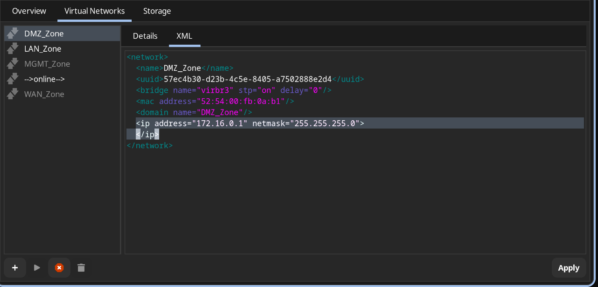

- The chosen solution was the second option; it better covers the needs of the project, since having the networks in complete isolation from the host avoids possible data contamination and information registered in logs from unforeseen communications between virtual machines and the host. 

ES:  La solución elegida fue la segunda opción; esta es la que se adapta mejor a las necesidades del proyecto, ya que el total aislamiento de las redes hacia el anfitrión evita la posible contaminación en los datos e información que puede aparecer en registros por comunicación imprevista entre las máquinas virtuales y el anfitrión.

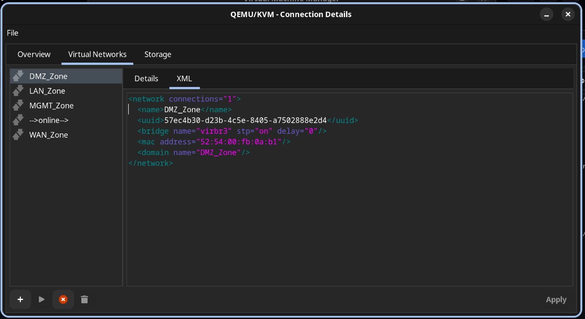

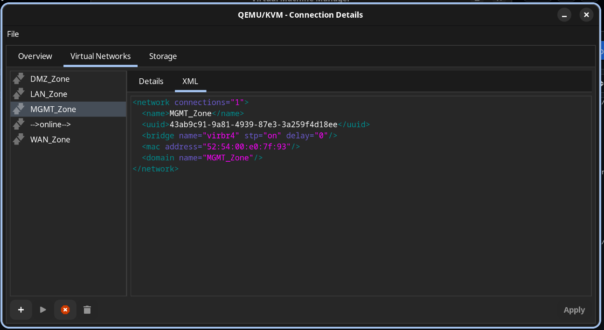

- To wrap up, with both networks completely isolated from Fedora, it is necessary to grant Fedora access to Ubuntu-Wazuh for easy management and troubleshooting. This access is granted by 2 methods:

  1. At the network level, using pfSense firewall rules to connect Fedora through the bridge between it and the LAN network on 192.168.200.254, passing communications on port TCP/22 for ***SSH***, a fast, reliable and secure communication protocol.
 
  2. A (virtual) straight connection, similar to a serial cable connected directly between Fedora and Ubuntu-Wazuh, via ***virsh console***, a tool of virt-manager. This connection doesn't need the network to be working to connect Fedora to Ubuntu-Wazuh, which makes it well suited for troubleshooting and for repairing the virtual machine even if it has boot problems.

ES: Para cerrar, con ambas redes en completo aislamiento de Fedora, es necesario garantizarle a este acceso a Ubuntu-Wazuh para facilidad de administración y solución de problemas. Este acceso es garantizado mediante 2 métodos:

  1. A nivel de red, utilizando reglas de firewall en pfSense para conectar Fedora por medio del puente entre este y la red LAN en 192.168.200.254, dejando pasar comunicación por el puerto TCP/22 para ***SSH***, un protocolo de comunicación rápido, fiable y seguro.
    
  2. Por conexión directa (virtual), similar a un cable de serie que conecta directamente Fedora y Ubuntu-Wazuh, por medio de ***virsh console***, una herramienta de virt-manager. Esta conexión no necesita que la red se encuentre funcionando para conectar a Fedora con Ubuntu-Wazuh, lo que la hace apta para solucionar problemas y reparar la máquina virtual incluso si tiene problemas de arranque.

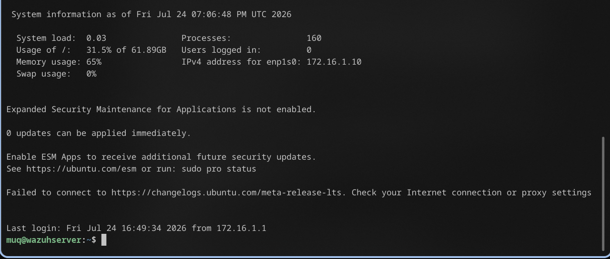

  SSH enabled and working.

ES: SSH habilitado y funcionando

- After enabling virsh console and running it, the host's console only responds to the exit key combination ```ctrl + ]```, so this line ```console=tty0 console=ttyS0, 115200n8``` must be added to Ubuntu-Wazuh's GRUB configuration file to tell the kernel to send the console output to 2 different consoles, ```console=ttyS0``` being the serial console that is connected to virsh console.

ES: Después de habilitar virsh console y ejecutarlo, la consola del anfitrión respondía a la combinación de teclas para cerrar virsh console ```ctrl + ]```, así que esta línea ```console=tty0 console=ttyS0, 115200n8``` se debe agregar al archivo de configuración del GRUB de Ubuntu-Wazuh para indicar al kernel que debe enviar la salida de la consola a 2 consolas distintas al mismo tiempo, siendo ```console=ttyS0``` la consola del puerto de serie virtual que se conecta a virsh console.

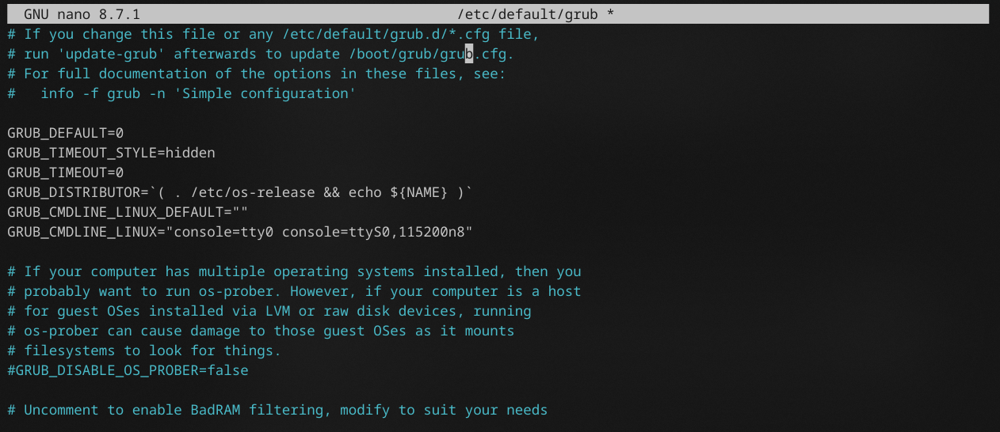

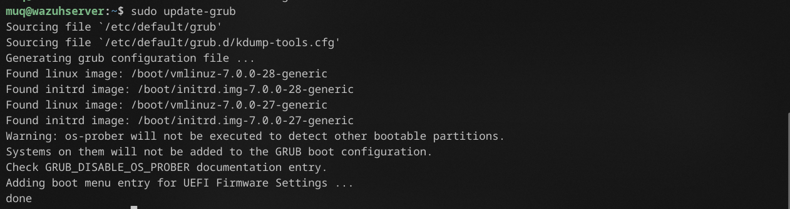

  GRUB modified and updated.

ES:  GRUB modificado y actualizado.

- Testing virsh console.

ES:  Probando virsh console.

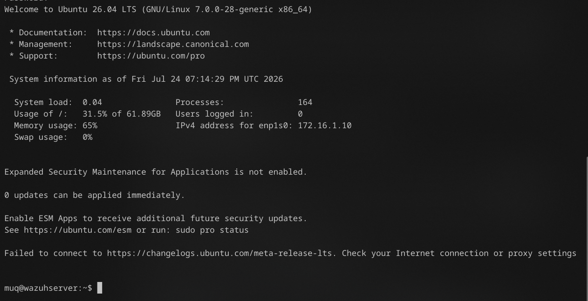

  Virsh console properly working.

ES:  Virsh console funcionando apropiadamente.
  
### -A Note on AI Assistance. (Nota sobre la asistencia de IA.)

Claude (Anthropic) and Gemini (Google) were used throughout this build as technical
thinking partners — explaining networking and security concepts as they came up,
suggesting hypotheses to test when something broke, and helping generate the
diagrams and structure this writeup. Every command, every test, and every
configuration change was run and verified by hand. The root-cause diagnosis of the
ARP conflict above — cross-referencing pfSense's and Debian's ARP tables against the
libvirt network configs to find the duplicate Layer 2 responder — was independent
work.

ES: (Claude (Anthropic) y Gemini (Google) se usaron a lo largo de este proyecto como
compañeros de pensamiento técnico — explicando conceptos de redes y seguridad a
medida que surgían, sugiriendo hipótesis para probar cuando algo fallaba, y
ayudando a generar los diagramas y estructurar este documento. Cada comando, cada
prueba y cada cambio de configuración fue ejecutado y verificado a mano. El
diagnóstico de la causa raíz del conflicto ARP arriba — comparando las tablas ARP
de pfSense y Debian con las configuraciones de red de libvirt para encontrar el
respondedor duplicado de Capa 2 — fue trabajo independiente.

---

# **Wazuh MGMT zone has no internet path: AiSOC calls to Gemini/Groq fail. (Zona MGMT de Wazuh sin acceso a internet: las llamadas de AiSOC a Gemini/Groq fallan)**

### Problem (Problema)

AiSOC (integrated on Wazuh) failed every call to Gemini and Groq with a DNS resolution error (`NameResolutionError`, `Temporary failure in name resolution`) for both `generativelanguage.googleapis.com` and `api.groq.com`. This is expected behavior, not a bug in AiSOC itself — MGMT was deliberately built as a fully isolated, out-of-band zone with no DNS, no default route, and no NAT path to the real internet.

ES: *AiSOC, integrado en Wazuh, falló en cada llamada a Gemini y Groq con un error de resolución DNS. Esto es un comportamiento esperado, no un error de AiSOC — MGMT se construyó deliberadamente como una zona totalmente aislada y fuera de banda, sin DNS, sin ruta por defecto y sin NAT hacia internet real.*

**Immediate action, independent of the network fix:** both API keys (Gemini, Groq) were revoked, since the failed-call logs had already printed the live key strings in plaintext.

ES: *Acción inmediata, independiente de la solución de red: ambas llaves de API — Gemini y Groq — fueron revocadas, ya que los registros de las llamadas fallidas ya habían impreso las llaves en texto plano.*

### Discarded approach: second NIC on Wazuh (Enfoque descartado: segunda NIC en Wazuh)

A second NIC (libvirt's default NAT'd network, `192.168.100.0/24` via `virbr0`) was attached directly to the Wazuh VM to reach the internet for `apt`/`pip`. Two problems surfaced:

- **It never actually worked as intended.** `ip route show` on the guest revealed two competing default routes — the original static MGMT route (`via 172.16.1.1`, implicit metric 0) and the new NIC's DHCP route (`via 192.168.100.1`, metric 1024). Linux prefers the lowest metric, so all traffic, including the `8.8.8.8` test ping, kept going out the MGMT interface, not the new NIC.
- **It broke the isolation model even if it had worked.** MGMT is documented as fully out-of-band specifically so nothing unaccounted-for touches it. A second NIC creates an egress path pfSense never sees or logs — no firewall rule, no visibility in `Status > System Logs`.

The NIC was removed (confirmed via `virt-manager` showing a single `MGMT_Zone` NIC, and guest-side `ip a` / `ip route show` showing only `enp1s0` and the one static route to `172.16.1.1`).

ES: *Se conectó una segunda NIC directamente a la VM de Wazuh para llegar a internet. Nunca funcionó como se esperaba por dos rutas por defecto compitiendo, y además rompía el modelo de aislamiento documentado para MGMT, ya que ese tráfico nunca sería visto ni registrado por pfSense. La NIC fue removida y confirmada como eliminada tanto en virt-manager como dentro del propio invitado.*

### Chosen approach: NAT MGMT egress out through LAN via pfSense (Enfoque elegido: salida de MGMT vía LAN a través de pfSense)

**Correction made along the way:** the first plan assumed outbound NAT should go out pfSense's WAN interface, following the standard pfSense pattern. That's backwards for this lab — WAN is deliberately the isolated Kali/attacker-simulation zone with no real internet path at all. **LAN** is the only zone bridged to Fedora's real network (`virbr1` → Fedora's physical NIC `enp7s0`), so that's the only viable egress.

ES: *Corrección hecha en el camino: el plan inicial asumía que el NAT de salida debía usar la interfaz WAN de pfSense. Eso está invertido para este laboratorio — WAN es deliberadamente la zona aislada de simulación de atacante (Kali), sin salida real a internet. LAN es la única zona conectada a la red real de Fedora, así que es la única salida viable.*

Diagnosis proceeded layer by layer, on both Fedora and pfSense:

1. **`net.ipv4.ip_forward`** on Fedora — already `1`. No action needed.
2. **`firewall-cmd --get-active-zones`** — `enp7s0` and `virbr1` both sit in the same zone (`public`), so no cross-zone forwarding policy was needed, only the zone's own settings.
3. **Masquerade check** — `firewall-cmd --zone=public --list-all` showed `masquerade: no`. This was the missing piece for Fedora to rewrite MGMT's private source IPs before sending them out `enp7s0`. Fixed:
   ```bash
   sudo firewall-cmd --zone=public --add-masquerade --permanent
   sudo firewall-cmd --reload
   ```
   Confirmed `masquerade: yes` afterward.
4. **Retest (pfSense Diagnostics > Ping, source LAN, target `8.8.8.8`)** — still 100% packet loss, no reply at all. Masquerade alone wasn't enough.

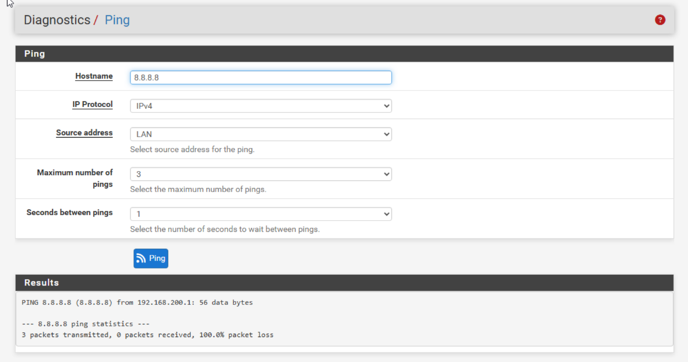
   
5. **pfSense gateway check (System > Routing > Gateways)** — no IPv4 gateway existed on LAN at all; only IPv6 DHCP gateways plus an unused `WAN_DHCP` (IPv4), with `Default gateway IPv4` set to `Automatic`. Since WAN never gets a real DHCP lease (it's the isolated zone), "Automatic" was effectively resolving to nothing.

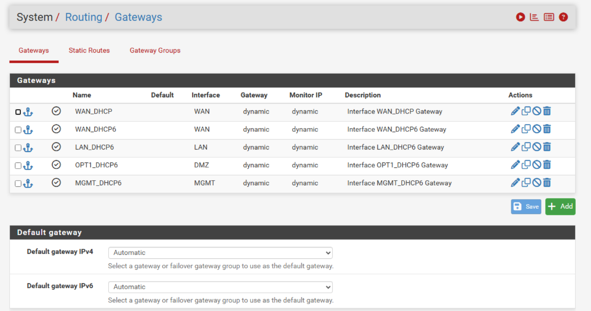

6. **Correction made along the way:** the first plan was to add a `0.0.0.0/0` static route via a new LAN gateway. pfSense's GUI does not allow static routes to `0.0.0.0/0` — the default route can only be set through **System > Routing > Gateways > Default gateway**, not the Static Routes page.
7. **Fix applied:** added a new gateway —
   - Interface: LAN
   - Address Family: IPv4
   - Name: `LAN_FEDORA_GW`
   - Gateway: `192.168.200.254` (Fedora's `virbr1` bridge address)

   Then set **Default gateway IPv4** to `LAN_FEDORA_GW` and applied. This leaves `WAN_DHCP` and pfSense's WAN config completely untouched.

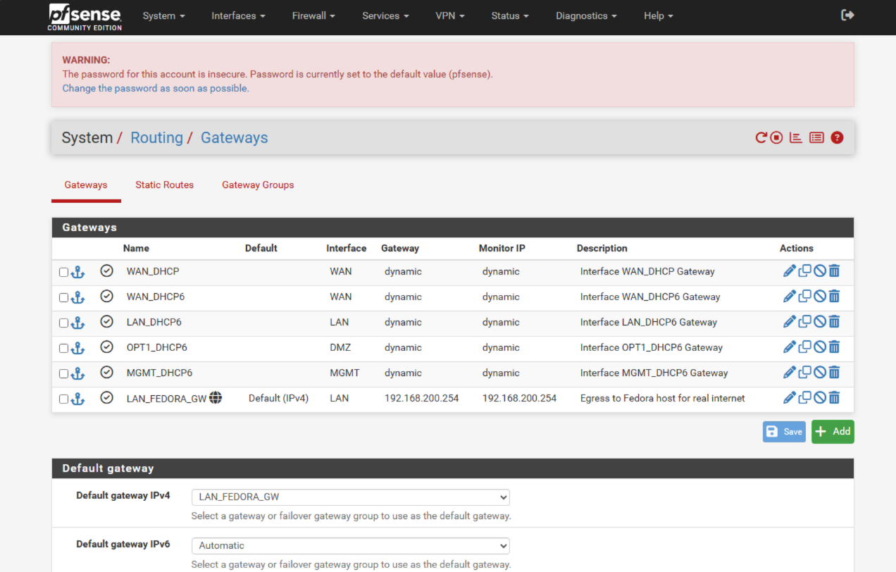
   
8. **Retest** — packet loss changed character: instead of silent 100% loss, pfSense now received an explicit reply on all 3 pings — **"Destination Port Unreachable" from `192.168.200.254`** (Fedora's own bridge address). This is meaningful: the packet is now actually reaching Fedora and being actively rejected, rather than getting lost with no route.

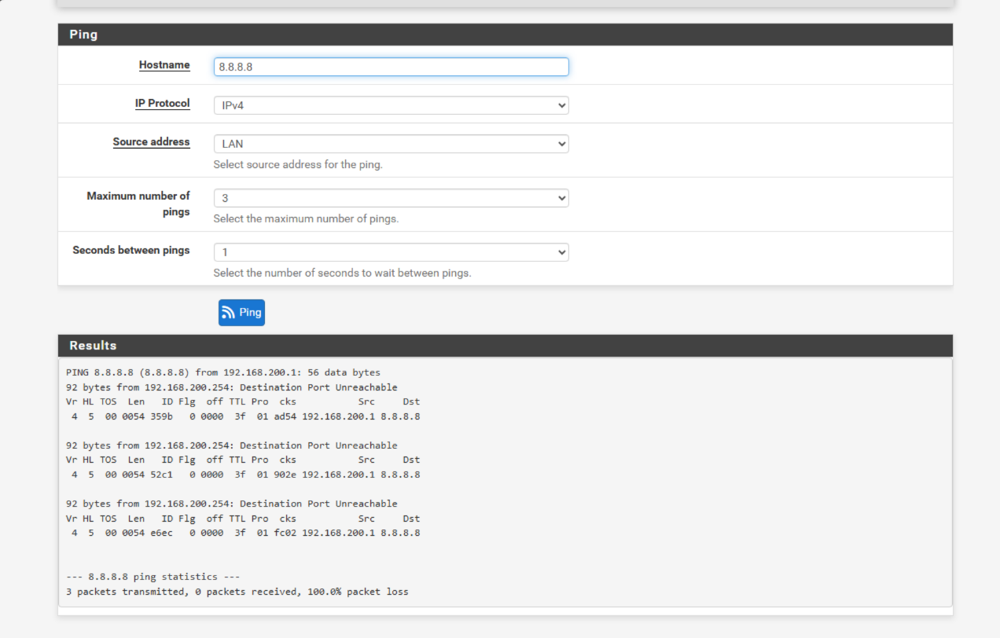

ES: *El diagnóstico avanzó capa por capa, tanto en Fedora como en pfSense: reenvío de paquetes ya activo, masquerade faltante y luego corregido, sin gateway IPv4 en LAN, corrección sobre el uso incorrecto de una ruta estática 0.0.0.0/0 — en pfSense el gateway por defecto solo se configura desde Gateways, no desde Rutas Estáticas — y finalmente la adición de un gateway real en LAN apuntando al puente de Fedora. La prueba pasó de pérdida silenciosa de paquetes a una respuesta explícita de "Destination Port Unreachable" desde la propia dirección de Fedora, señal de que el paquete ya llega pero es rechazado activamente.*

### Root cause (Causa raíz)

`virbr1` is defined in libvirt as an **Isolated network** type (confirmed in `virt-manager`'s NIC details panel). Per libvirt's own firewall model, isolated networks get dedicated `iptables`/`nftables` chains (`LIBVIRT_FWI` / `LIBVIRT_FWO` / `LIBVIRT_FWX`) that explicitly **REJECT — with `reject-with icmp-port-unreachable`, matching exactly what was observed** — any forwarded traffic between that bridge and any other interface. This enforcement is independent of, and takes precedence over, firewalld's own zone-level `forward`/`masquerade` settings.

That's why every fix so far was necessary but not sufficient: `ip_forward=1`, `masquerade=yes`, and a correct pfSense default gateway all had to be true for the packet to even reach the point of being forwarded — but libvirt's own isolation rule for `virbr1` rejects it regardless, by design, since "isolated" is meant to guarantee exactly that.

ES: *`virbr1` está definido en libvirt como una red de tipo **Isolated**. Según el modelo de firewall propio de libvirt, las redes aisladas reciben cadenas dedicadas de iptables/nftables que rechazan explícitamente — con `reject-with icmp-port-unreachable`, coincidiendo exactamente con lo observado — cualquier tráfico reenviado entre ese puente y cualquier otra interfaz. Este bloqueo es independiente de la configuración de zona de firewalld y tiene prioridad sobre ella. Por eso cada corrección anterior era necesaria pero no suficiente: libvirt rechaza el reenvío por diseño, ya que "aislada" está pensado para garantizar justamente eso.*

### Next step (Siguiente paso)

Resolving this means changing how libvirt treats `virbr1`'s forwarding — either altering the network's `<forward>` mode, or inserting an explicit allow ahead of libvirt's own `REJECT` rules — without breaking the deliberate design where **pfSense**, not libvirt, is the router for this topology. This has not been attempted yet.

ES: *Resolver esto implica cambiar cómo libvirt trata el reenvío de `virbr1` — ya sea alterando el modo `<forward>` de la red, o insertando una regla de permiso explícita antes de las reglas REJECT propias de libvirt — sin romper el diseño deliberado donde pfSense, no libvirt, es el enrutador de esta topología. Esto aún no se ha intentado.*

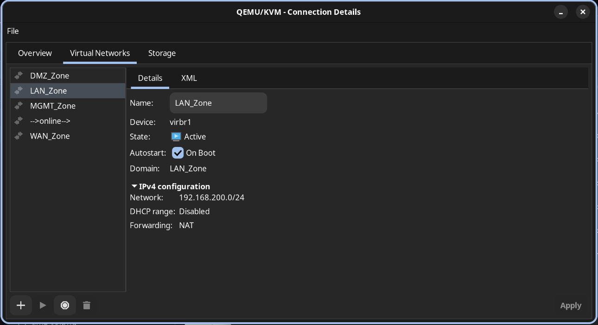

At the same time, two more pieces were required together before the path fully worked:

- **pfSense MGMT rule**, temporarily widened to Any/Any/Any for testing (later locked back down — see below).

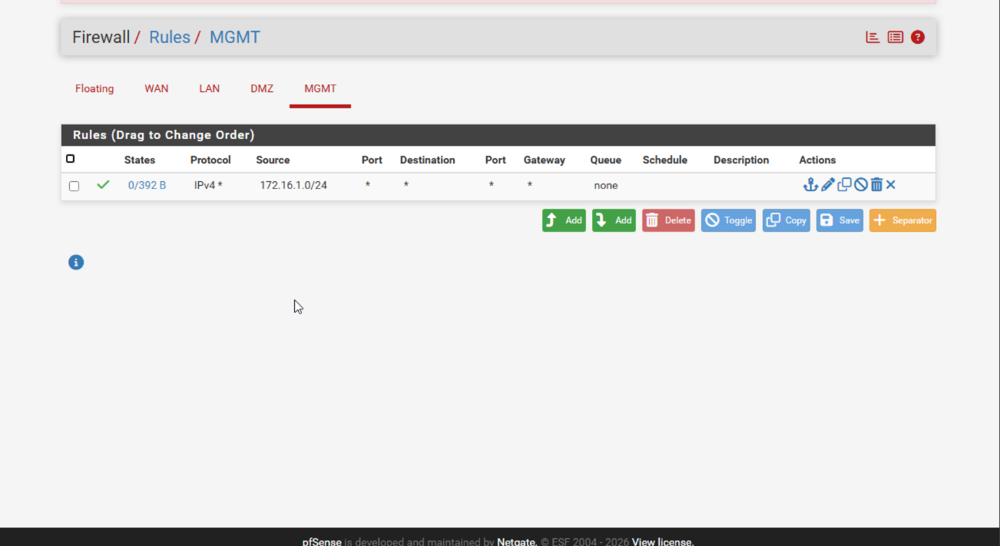

- **pfSense Outbound NAT** (Hybrid mode): Interface LAN, Source `172.16.1.0/24`, Translation = Interface Address.

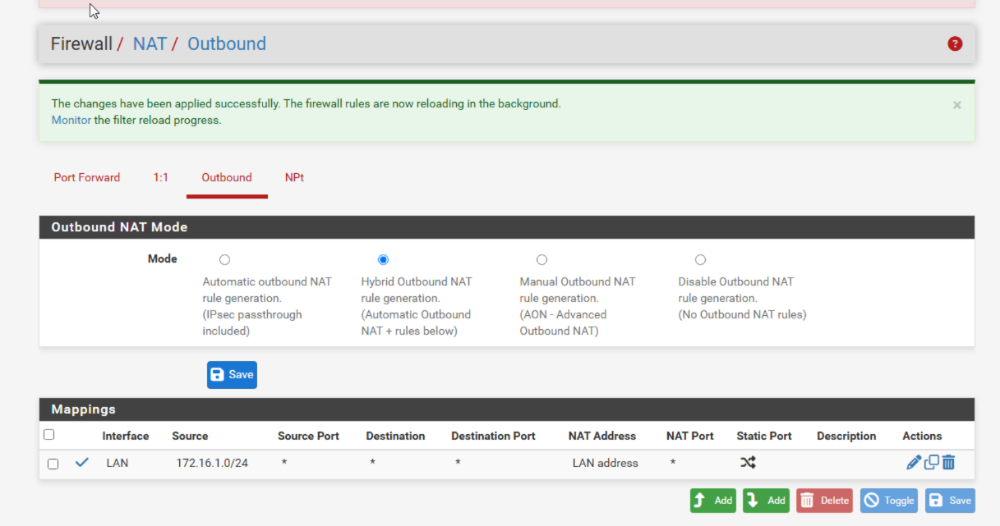

With libvirt's NAT mode, the MGMT rule, and the Outbound NAT mapping all in place together, both `pfSense → 8.8.8.8` and `Wazuh → 8.8.8.8` pings confirmed 0% packet loss.

ES: *Al mismo tiempo, se necesitaron dos piezas más junto con lo anterior: la regla de MGMT ampliada temporalmente para pruebas, y el NAT de salida en modo Hybrid con la traducción hacia la dirección de LAN. Con las tres piezas juntas, las pruebas de ping confirmaron 0% de pérdida de paquetes.*

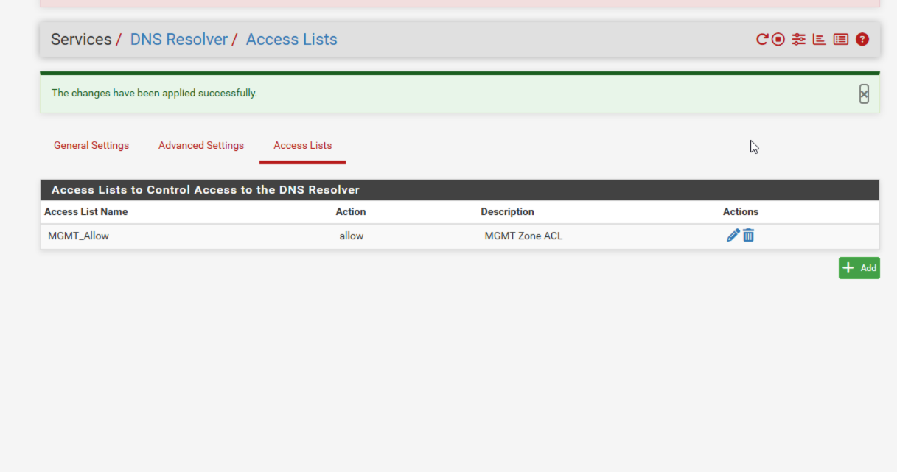

**DNS — the actual cause wasn't Unbound's ACL.** A `MGMT_Allow` access list already existed and was correctly configured; the REFUSED-style symptom was actually the query never leaving Wazuh at all. `resolvectl status` showed `Current Scopes: none` on `enp1s0` — systemd-resolved had no nameserver assigned, and netplan's `00-installer-config.yaml` had no `nameservers:` block to begin with. Fixed by adding:

```yaml
nameservers:
  addresses: [172.16.1.1]
```

and running `netplan apply`. Confirmed persistent (sourced from the config file, not a runtime-only `resolvectl` override).

ES: *DNS — la causa real no era la lista de acceso de Unbound, que ya estaba bien configurada. La consulta nunca salía de Wazuh: systemd-resolved no tenía servidor de nombres asignado, ya que el archivo netplan no incluía el bloque `nameservers`. Se corrigió agregando ese bloque y aplicando `netplan apply`, confirmado como persistente.*

**Final MGMT ruleset**, locked down from the wide-open testing rule to three least-privilege rules:

| # | Protocol | Source | Destination | Port | Purpose |
|---|----------|--------|-------------|------|---------|
| 1 | TCP/UDP | MGMT net | `172.16.1.1` | 53 (DNS) | Queries to pfSense's own resolver |
| 2 | ICMP (Echo Request) | MGMT net | any | — | Diagnostics (ping) |
| 3 | TCP | MGMT net | `AI_API_Endpoints` alias | 443 | Groq + Gemini API calls |

Rule 2 originally selected **Echo Reply** instead of **Echo Request** — an easy mix-up, since pfSense lists them adjacently in the subtype picker. Since pfSense is stateful, only the request direction needed an explicit rule; the reply is auto-permitted via the state table once corrected.

ES: *Regla final de MGMT: tres reglas de privilegio mínimo — DNS hacia el resolutor de pfSense, ICMP Echo Request para diagnóstico, y TCP/443 hacia el alias de las APIs de IA. La regla ICMP inicialmente tenía seleccionado "Echo Reply" en vez de "Echo Request" por error — al ser pfSense un firewall con estado, solo la solicitud necesitaba regla explícita.*

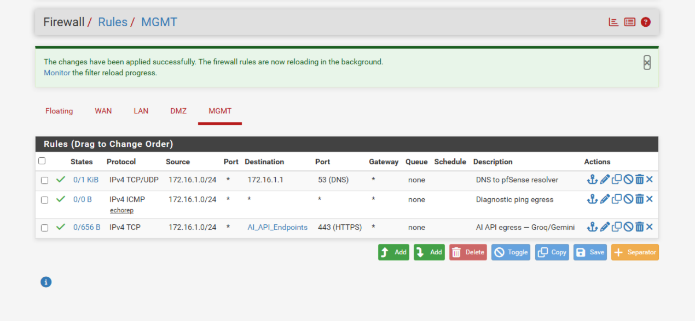

Final verification — `resolvectl query`, `nc -zv <host> 443` for both Groq and Gemini, and `ping -c3 8.8.8.8` — all succeeded from Wazuh through the locked-down ruleset.

### Known accepted limitation (Limitación aceptada conocida)

Gemini's API sits behind Google's anycast infrastructure with many rotating addresses. pfSense's FQDN-type alias only re-resolves periodically and caches a small snapshot, while Wazuh's own DNS queries can return a different IP each time. This produces intermittent blocked connections to Gemini specifically — visible in the firewall log as legitimate TCP SYNs to shifting `172.217.x.x` addresses hitting default-deny, not a misconfiguration. Documented as an accepted risk rather than something to chase further. If it becomes a practical problem, options are: a shorter alias re-resolution interval, a broader IP-range allow (trades away some least-privilege precision), or relying on AiSOC's own retry logic to absorb occasional failures.

ES: *La API de Gemini está detrás de infraestructura anycast de Google con muchas direcciones rotativas. El alias de pfSense se re-resuelve periódicamente pero con una instantánea pequeña, mientras que las consultas DNS de Wazuh pueden devolver una IP distinta cada vez. Esto produce bloqueos intermitentes hacia Gemini específicamente — no es un error de configuración, sino un límite estructural. Se documenta como riesgo aceptado en vez de algo a resolver más a fondo.*

---

# **WAN ->LAN ICMP Connectivity Troubleshooting (Solución de problemas de conectividad ICMP WAN -> LAN)**

**Date / Fecha:** 2026-08-04
**Lab zone / Zona del laboratorio:** WAN (10.10.0.0/24) → LAN (192.168.200.0/24)
**Source / Origen:** Kali — 10.10.0.10
**Target / Objetivo:** Win11Lab — 192.168.200.40
**pfSense version:** 2.8.1-RELEASE

---

## Overview / Resumen

A WAN-to-LAN ICMP echo rule appeared correctly configured and enabled in the pfSense GUI, but real ping traffic from Kali consistently failed with 100% packet loss. Troubleshooting surfaced two independent, unrelated problems stacked on top of each other — a firewall-rule compilation issue on pfSense, and a default host-based firewall block on the Windows target. Neither was visible from the other's vantage point, which is the core lesson of this entry.

ES: Una regla ICMP echo de WAN a LAN aparecía correctamente configurada y habilitada en la interfaz gráfica de pfSense, pero el tráfico de ping real desde Kali fallaba consistentemente con 100% de pérdida de paquetes. La investigación reveló dos problemas independientes y no relacionados, superpuestos entre sí: un problema de compilación de reglas en pfSense y un bloqueo predeterminado del firewall del host en el objetivo Windows. Ninguno era visible desde el punto de vista del otro, lo cual es la lección central de esta entrada.

## Lab Topology Recap / Recapitulación de la topología

| Zone / Zona | Interface | Network | Key Host |
|---|---|---|---|
| WAN | vtnet0 | 10.10.0.0/24 | Kali — 10.10.0.10 |
| LAN | vtnet1 | 192.168.200.0/24 | Win11Lab — 192.168.200.40 |

## Finding 1: pfSense WAN Rule Compilation Gap
## Hallazgo 1: Falla de compilación de regla WAN en pfSense

### Issue / Problema

`ping -c4 192.168.200.40` from Kali returned 100% packet loss. The WAN-tab firewall rule permitting ICMP echo-request from 10.10.0.10 to the LAN subnet showed as enabled in the rules list, with a green check and no visible errors.

ES: `ping -c4 192.168.200.40` desde Kali devolvía 100% de pérdida de paquetes. La regla de firewall en la pestaña WAN que permitía ICMP echo-request desde 10.10.0.10 hacia la subred LAN se mostraba habilitada en la lista de reglas, con una marca verde y sin errores visibles.

### Diagnostic Process / Proceso de diagnóstico

1. Ruled out RFC1918/bogon blocking on the WAN interface (`Interfaces > WAN > Reserved Networks` — both boxes unchecked).
2. Confirmed Kali-side routing and layer-2 resolution were healthy: `ip route` showed a correct default route via 10.10.0.1, and `ip neigh show` showed the gateway MAC as `REACHABLE`.
3. Checked `Status > Interfaces` and found WAN's **in/out packets (block)** counter incrementing on every ping attempt (1043 blocked vs. 18 passed) — meaning packets *were* arriving at the NIC but being actively dropped by pf, not lost at the network layer.
4. Ruled out Floating rules (`Firewall > Rules > Floating` — none defined).
5. Read `Status > System Logs > Firewall` directly and found the exact drop, timestamped against a live ping attempt:
   ```
   Aug 4 20:48:04  WAN  Default deny rule IPv4 (1000000103)  10.10.0.10 → 192.168.200.40  ICMP
   ```
6. Confirmed via console: `pfctl -sr | grep -i "10.10.0.10"` showed the RDP and DVWA WAN rules compiled correctly, but the ICMP echo rule was **entirely absent** from the compiled ruleset — despite being visible and enabled in the GUI.

ES:
1. Se descartó el bloqueo de redes RFC1918/bogon en la interfaz WAN (`Interfaces > WAN > Reserved Networks`, ambas casillas desmarcadas).
2. Se confirmó que el enrutamiento y la resolución de capa 2 en Kali eran correctos: `ip route` mostraba una ruta predeterminada correcta vía 10.10.0.1, y `ip neigh show` mostraba la MAC del gateway como `REACHABLE`.
3. Se revisó `Status > Interfaces` y se encontró que el contador **in/out packets (block)** de WAN aumentaba con cada intento de ping (1043 bloqueados frente a 18 permitidos), lo que indicaba que los paquetes **sí llegaban** a la NIC pero eran descartados activamente por pf, no perdidos en la capa de red.
4. Se descartaron las reglas Floating (`Firewall > Rules > Floating`, ninguna definida).
5. Se revisó directamente `Status > System Logs > Firewall` y se encontró el descarte exacto, con marca de tiempo coincidente con un intento de ping en vivo:
   ```
   Aug 4 20:48:04  WAN  Default deny rule IPv4 (1000000103)  10.10.0.10 → 192.168.200.40  ICMP
   ```
6. Se confirmó por consola: `pfctl -sr | grep -i "10.10.0.10"` mostró las reglas WAN de RDP y DVWA compiladas correctamente, pero la regla ICMP echo estaba **completamente ausente** del conjunto de reglas compilado, a pesar de estar visible y habilitada en la interfaz gráfica.

### Root Cause / Causa raíz

The GUI rule list did not reliably reflect the compiled (active) ruleset. `pfctl -sr` is the only authoritative source for what pf is actually enforcing at any given moment.

ES: La lista de reglas de la interfaz gráfica no reflejaba de forma confiable el conjunto de reglas compilado (activo). `pfctl -sr` es la única fuente autorizada de lo que pf realmente está aplicando en un momento dado.

### Resolution / Resolución

Deleted and re-created the WAN ICMP rule, then re-verified against `pfctl -sr`. Confirmed compiled and active:
```
pass in quick on vtnet0 inet proto icmp from 10.10.0.10 to 192.168.200.40 icmp-type echoreq keep state (if-bound) label "USER_RULE" label "id:1785878593" ridentifier 1785878593
```
Destination was deliberately scoped to the single active target (192.168.200.40) rather than the full /24, to keep the firewall log signal focused on current pentest activity. Widening to the subnet (or adding a second scoped rule) is a one-line change when DC01 or other LAN hosts enter scope.

A separate no-op rule on the LAN tab (Tracking ID 1785875459 — ICMP from 10.10.0.10 on the LAN interface, which can never match since that source physically cannot arrive on that interface) was identified as leftover clutter and flagged for deletion.

ES: Se eliminó y volvió a crear la regla ICMP de WAN, y se verificó nuevamente contra `pfctl -sr`. Se confirmó que estaba compilada y activa (ver bloque de código arriba). El destino se limitó deliberadamente al objetivo activo único (192.168.200.40) en lugar de todo el /24, para mantener el registro del firewall enfocado en la actividad actual del pentest. Ampliarlo a la subred (o agregar una segunda regla con alcance específico) es un cambio de una línea cuando DC01 u otros hosts LAN entren en alcance.

Se identificó una regla superflua en la pestaña LAN (ID de seguimiento 1785875459 — ICMP desde 10.10.0.10 en la interfaz LAN, que nunca puede coincidir porque ese origen no puede llegar físicamente a esa interfaz) como residuo a eliminar.

## Finding 2: Windows Defender Firewall ICMP Block
## Hallazgo 2: Bloqueo de ICMP por Windows Defender Firewall

| | EN | ES |
|---|---|---|
| **Attack / Ataque** | ICMP echo-request (ping) host-discovery probe from Kali to Win11Lab, now correctly passed through pfSense. | Sondeo de descubrimiento de host mediante ICMP echo-request (ping) desde Kali hacia Win11Lab, ya correctamente permitido por pfSense. |
| **Defender Signal / Señal del defensor** | Windows Defender Firewall's default inbound rule set silently dropped ICMPv4 Echo Requests. No TCP-style reset, no ICMP unreachable — just silence, indistinguishable at first glance from an upstream network drop. | El conjunto de reglas entrantes predeterminado de Windows Defender Firewall descartaba silenciosamente las solicitudes ICMPv4 Echo. Sin reset tipo TCP, sin ICMP inalcanzable — solo silencio, indistinguible a primera vista de un descarte en la red. |
| **Mitigation Control / Control de mitigación** | Explicit inbound allow rule added via PowerShell: `New-NetFirewallRule -Name "Allow_Ping" -DisplayName "Allow ICMPv4-In (Ping)" -Protocol ICMPv4 -IcmpType 8 -Action Allow -Enabled True` | Regla de entrada explícita agregada vía PowerShell: `New-NetFirewallRule -Name "Allow_Ping" -DisplayName "Allow ICMPv4-In (Ping)" -Protocol ICMPv4 -IcmpType 8 -Action Allow -Enabled True` |

### Evidence / Evidencia

Packet capture on Kali's own interface was the deciding evidence — not pfSense's logs, since pf had nothing left to log once the packet was correctly passed.

`fail_ping.pcap` — before the Windows Firewall fix:
```
4x Echo (ping) request, 10.10.0.10 → 192.168.200.40, ttl=64
0x replies
```

`PingSuccess.pcapng` — after the fix:
```
10.10.0.10 → 192.168.200.40   type=8 (echo request)   ttl=64
192.168.200.40 → 10.10.0.10   type=0 (echo reply)     ttl=127
```
(x4, symmetric request/reply pairs, sub-millisecond turnaround)

ES: La captura de paquetes en la propia interfaz de Kali fue la evidencia decisiva, no los registros de pfSense, ya que pf no tenía nada más que registrar una vez que el paquete se permitió correctamente. (Ver bloques de código arriba.)

## Lessons Learned / Lecciones aprendidas

- **The GUI is not ground truth.** `pfctl -sr` is the only reliable way to confirm what pfSense is actually enforcing, independent of what the web interface displays.
- **Firewall logs only show what that firewall did.** Once pfSense correctly passes a packet, it has nothing further to log — a silent drop further down the path (in this case, the destination host itself) is invisible from pfSense's perspective no matter how thoroughly its logs are read.
- **Packet capture at the source is the tiebreaker.** Comparing request-sent vs. reply-received on Kali's own interface was the only vantage point that could distinguish "somewhere in the network path" from "the destination host itself" as the cause of silence.
- **ICMP has no failure signal.** Unlike TCP (RST) or some UDP cases (ICMP port-unreachable), a dropped ICMP echo request just produces silence — making source-side capture the default diagnostic step for any "ping just doesn't work" case, not a last resort.

ES: - **La interfaz gráfica no es la verdad absoluta.** `pfctl -sr` es la única forma confiable de confirmar lo que pfSense realmente está aplicando, independientemente de lo que muestre la interfaz web.
- **Los registros del firewall solo muestran lo que ese firewall hizo.** Una vez que pfSense permite correctamente un paquete, no tiene nada más que registrar; un descarte silencioso más adelante en la ruta (en este caso, el propio host de destino) es invisible desde la perspectiva de pfSense sin importar cuán a fondo se lean sus registros.
- **La captura de paquetes en el origen es el desempate.** Comparar solicitudes enviadas frente a respuestas recibidas en la propia interfaz de Kali fue el único punto de vista capaz de distinguir "en algún punto de la red" de "el propio host de destino" como causa del silencio.
- **ICMP no tiene señal de fallo.** A diferencia de TCP (RST) o algunos casos de UDP (ICMP puerto inalcanzable), una solicitud ICMP echo descartada simplemente produce silencio, lo que convierte la captura desde el origen en el paso de diagnóstico predeterminado para cualquier caso de "el ping simplemente no funciona", no en un último recurso.

## Appendix: Commands Used / Apéndice: Comandos utilizados

```bash
# Kali — routing / ARP verification
ip route
ip neigh show
ping -c4 192.168.200.40

# pfSense console — compiled ruleset inspection
pfctl -sr | grep -i "10.10.0.10"

# Windows — allow inbound ICMPv4 echo
New-NetFirewallRule -Name "Allow_Ping" -DisplayName "Allow ICMPv4-In (Ping)" `
  -Protocol ICMPv4 -IcmpType 8 -Action Allow -Enabled True
```

## Suggested Commit Message / Mensaje de commit sugerido

```
docs(home-lab): WAN-LAN ICMP troubleshooting — pfSense rule compilation gap + Windows Firewall block

- pfctl -sr revealed WAN ICMP rule missing from compiled ruleset despite GUI showing enabled
- packet capture on Kali isolated a second, unrelated block: Windows Defender Firewall dropping ICMPv4-In by default
- resolved both; documented methodology (GUI != ground truth, source-side capture as tiebreaker)
```


