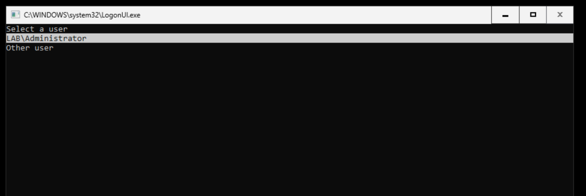

# Learned

### - On ADDC Server behavior. (Comportamiento de servidor ADDC.)

- The default restriction on Active Directory Domain Controller -ADDC-, keeping standard accounts from logging in, in order to maintain a secure NTDS.dit database. Standard users can't log in via an interactive session on Domain Controller, but must do it over the network via Kerberos/LDAP -Lightweight Directory Access Protocol-

  (Las restricciones predeterminadas del servidor ADDC mantienen fuera de acceso cuentas estándar para mantener segura la base de datos NTDS.dit. Los usuarios estándar no pueden acceder al servidor DC mediante sesión interactiva, deben hacerlo a través de la red vía Kerberos/LDAP.)
  

____

### - Adding agentless monitoring on pfSense to Wazuh using Syslog. (Agregar monitoreo sin agentes a pfSense hacia Wazuh usando Syslog.)

The goal, since 

ES: El objetivo, ya que esta forma de monitoreo se agrega a un laboratorio con redes en 4 zonas establecidas para replicar la funcionalidad de una red organizacional, con sus potenciales vulnerabilidades y el cual ademas ya cuenta con una regla de permiso de respuesta de ping entre Kali Linux en 10.10.0.10 (WAN) hacia Windows 11 Enterprise en 192.168.200.40 (LAN) para pruebas en caso de fallos, considero que agregar reglas que bloqueen la conexión ICMP desde Kali Linux hacia Ubuntu-Wazuh en 172.16.0.10 (MGMT) y hacia Microsoft Server DC01 en 192.168.200.10 (LAN) para poder implementar en Wazuh la recolección y monitorización de estos registros generados desde pfSense sin tener que instalar un agente, puede ser de gran utilidad para comprender mejor el funcionamiento y la implementación de ambas herramientas.
