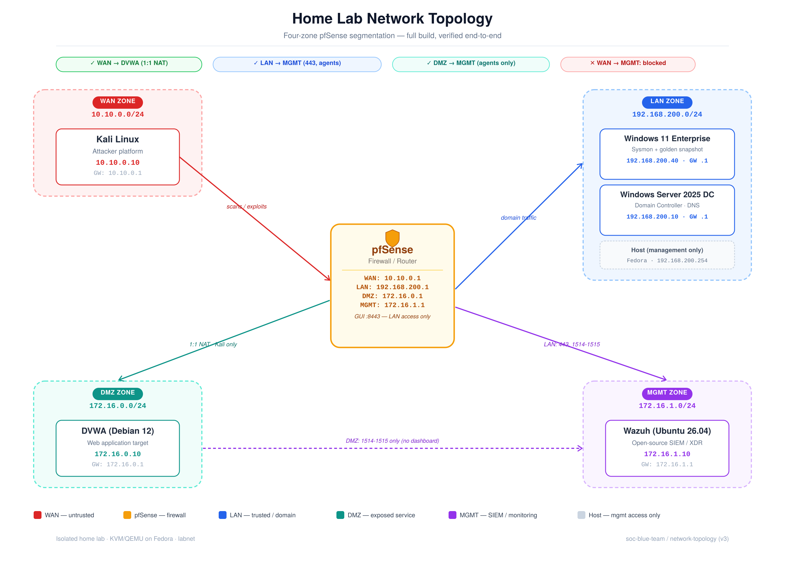

[<- GO BACK TO PORTFOLIO (REGRESAR)](https://github.com/MarvinUQ/MUQ-CyberSecurity-Portfolio)

# Home-lab Project.

## Lab Infrastructure & Network Architecture

The environment simulates an enterprise multi-tier infrastructure deployed inside an isolated hypervisor (KVM/QEMU on Fedora). Traffic routing, access control lists (ACLs), and inter-zone isolation are managed by a centralized virtualized pfSense firewall instance.

### Zone Segmentation Matrix
The infrastructure is carved into four distinct functional security zones to minimize blast radius and enforce strict egress/ingress rules:

| Security Zone | Subnet | Primary Assets | Trust Level / Purpose |
| :--- | :--- | :--- | :--- |
| **WAN Zone** | `10.10.0.0/24` | Kali Linux Attacker (Atacante) | **Untrusted** - Simulates external internet adversarial traffic.(**No confiable** - Simula ataques por adversario externo por trafico de internet) |
| **LAN Zone** | `192.168.200.0/24` | Win 11 Enterprise, Win Server 2025 DC | **Trusted** - Internal active directory domain infrastructure. (**Confiable** - Infraestructura de dominio directorio activo interno.) |
| **DMZ Zone** | `172.16.0.0/24` | DVWA (Debian 12 Web App) | **Semi-Trusted** - Public-facing exposed services with 1:1 NAT mapping. (**Semi Confiable** - Servicios expuestos a la red pública con un mapeo de NAT 1:1) |
| **MGMT Zone** | `172.16.1.0/24` | Wazuh SIEM (Ubuntu 26.04) | **Critical** - Out-of-band telemetry, log aggregation, and SOC monitoring. (**Crítca**) -  |

### Firewall Rule & Traffic Matrix
The pfSense engine implements stateful packet inspection based on the following specific traffic parameters:

*   **WAN → DMZ (Allowed):** Ingress traffic permitted exclusively via a 1:1 NAT mapping to the Debian 12 DVWA instance for external web application penetration testing.
*   **WAN → MGMT / LAN (Explicitly Blocked):** Total drop rules configured. Administrative dashboards (pfSense GUI on `:8443`) are strictly inaccessible from the WAN zone.
*   **LAN/DMZ → MGMT (Restricted Log Egress):** Windows/Debian nodes are strictly limited to egressing telemetry on ports `1514` and `1515` directly to the Wazuh server. No dashboard access or interactive sessions are allowed across this boundary.

____

## [-Learning by Building. (Aprender Haciendo.)](https://github.com/MarvinUQ/Home-Lab/blob/main/Learning%20and%20Building.md)

These are some of the concepts and behaviors of operating systems and tools this project has taught me so far

(Estos son algunos de los conceptos y comportamientos de los sistemas operativos y herramientas que he aprendido en este proyecto hasta el momento)

[-Adding agentless monitoring on pfSense to Wazuh using Syslog. (Agregar monitoreo sin agentes a pfSense hacia Wazuh usando Syslog.)](Learning%20and%20Building.md#adding-agentless-monitoring-on-pfsense-to-wazuh-using-syslog-agregar-monitoreo-sin-agentes-a-pfsense-hacia-wazuh-usando-syslog)

____

## White-Box-Testing: This conflicts, bugs and solutions are part of a larning method in which I had access to the entire process from pentesting to SOC analysis, to have a better understanding of how each role works closer to real life I will change the focus to a Black-Box-Testing approach that will help me on learning by testing and working each role focused on their respective tools, techniques and thought process.

## ES:

-[The DMZ <--> MGMT connection conflict. (Conflicto de comunicación DMZ <--> MGMT.)](Bugs-Conflicts-Fixing.md#**The-DMZ-<-->-MGMT-connection-conflict.-(Conflicto-de-comunicación-DMZ-<-->-MGMT.)**)

-[Wazuh MGMT zone has no internet path: AiSOC calls to Gemini/Groq fail. (Zona MGMT de Wazuh sin acceso a internet: las llamadas de AiSOC a Gemini/Groq fallan)](Bugs-Conflicts-Fixing.md#wazuh-mgmt-zone-has-no-internet-path-aisoc-calls-to-geminigroq-fail-zona-mgmt-de-wazuh-sin-acceso-a-internet-las-llamadas-de-aisoc-a-geminigroq-fallan)

-[WAN -> LAN ICMP Connectivity Troubleshooting (Solución de problemas de conectividad ICMP WAN -> LAN)](Bugs-Conflicts-Fixing.md#wan---lan-icmp-connectivity-troubleshooting-soluci%C3%B3n-de-problemas-de-conectividad-icmp-wan---lan)

-[Stale DHCP-Learned DNS from Detached "online" NIC (Kali) (DNS obsoleto obtenido por DHCP de tarjeta de red "con conexión a internet" desconectada (Kali))](Bugs-Conflicts-Fixing.md#stale-dhcp-learned-dns-from-detached-online-nic-kali-dns-obsoleto-obtenido-por-dhcp-de-tarjeta-de-red-con-conexi%C3%B3n-a-internet-desconectada-kali)
